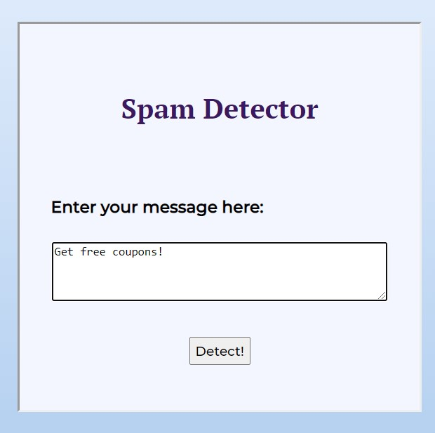
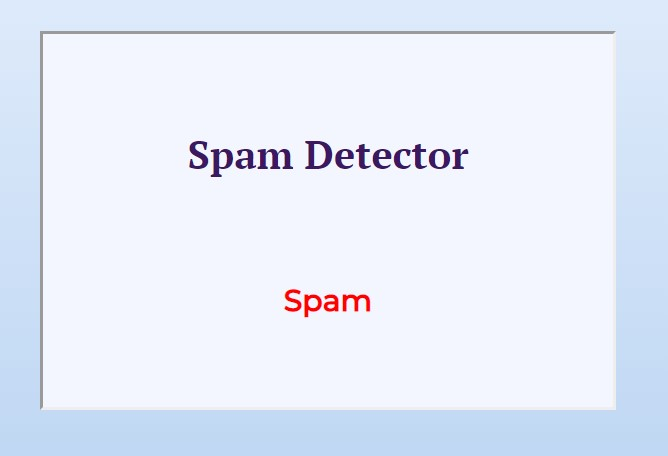
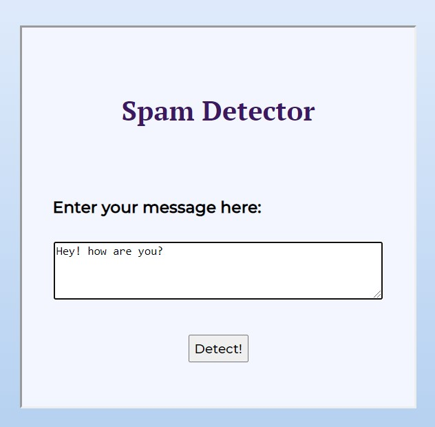

# Spam Detector Flask App

### <b> Hosted at: </b> https://spam-detector-300821.herokuapp.com/   

The Spam Detector is a Flask web application which predicts whether the message is <b> Spam </b> or <b> Ham</b>.

The dataset is taken from Kaggle and is used for classification of the message. First, the required libraries are imported and the dataset is loaded. Then, the text is cleaned by expanding contractions, converting the text to lower case, removing digits and punctuations and applying lemmatization and removing stopwords. After cleaning, the 'Category' attribute is encoded where 0->Ham an 1->Spam. Then, CountVectorizer() is applied on 'Message' attribute to convert text into vectors. Then, the dataset is split into train and test sets and Naive Bayes model is applied.

<i> Note: For longer sentences the model may not give accurate results because it has been trained on a small dataset. </i>

## Technologies Required

Please refer requirements.txt

## Web App

<b> GUI of the web app </b>

### SPAM

<b> Input: </b>

<b> Output: </b>

### HAM

<b> Input: </b>

<b> Output: </b>

